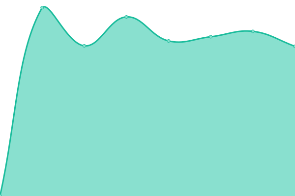
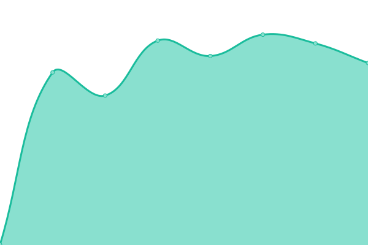
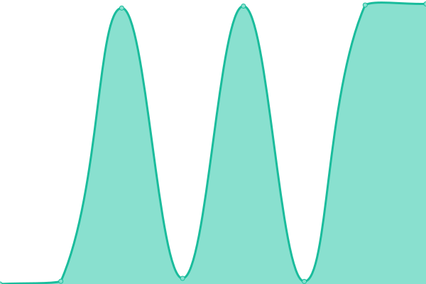

# [📈 Live Status](https://Source-Graphics-GmbH.github.io/upptime): <!--live status--> **🟧 Partial outage**

This repository contains the open-source uptime monitor and status page for [Source-Graphics-GmbH](https://Source-Graphics-GmbH.github.io/upptime), powered by [Upptime](https://github.com/upptime/upptime).

With [Upptime](https://upptime.js.org), you can get your own unlimited and free uptime monitor and status page, powered entirely by a GitHub repository. We use [Issues](https://github.com/Source-Graphics-GmbH/upptime/issues) as incident reports, [Actions](https://github.com/Source-Graphics-GmbH/upptime/actions) as uptime monitors, and [Pages](https://Source-Graphics-GmbH.github.io/upptime) for the status page.

<!--start: status pages-->
<!-- This summary is generated by Upptime (https://github.com/upptime/upptime) -->
<!-- Do not edit this manually, your changes will be overwritten -->
<!-- prettier-ignore -->
| URL | Status | History | Response Time | Uptime |
| --- | ------ | ------- | ------------- | ------ |
|  VoIP | 🟥 Down | [vo-ip.yml](https://github.com/Source-Graphics-GmbH/upptime/commits/HEAD/history/vo-ip.yml) | 

 0ms
     
 | 

<a href="https://Source-Graphics-GmbH.github.io/upptime/history/vo-ip">0.00%</a>
    

|  [Sharing](https://sharing.source-graphics.ch) | 🟥 Down | [sharing.yml](https://github.com/Source-Graphics-GmbH/upptime/commits/HEAD/history/sharing.yml) | 

 2256ms
     
 | 

<a href="https://Source-Graphics-GmbH.github.io/upptime/history/sharing">2.15%</a>
    

|  [Webmail for SG Services](https://webmail.services.source-graphics.ch/) | 🟥 Down | [webmail-for-sg-services.yml](https://github.com/Source-Graphics-GmbH/upptime/commits/HEAD/history/webmail-for-sg-services.yml) | 

 0ms
     
 | 

<a href="https://Source-Graphics-GmbH.github.io/upptime/history/webmail-for-sg-services">0.00%</a>
    

|  [Gitlab](https://gitlab.source-graphics.ch) | 🟥 Down | [gitlab.yml](https://github.com/Source-Graphics-GmbH/upptime/commits/HEAD/history/gitlab.yml) | 

 0ms
     
 | 

<a href="https://Source-Graphics-GmbH.github.io/upptime/history/gitlab">0.00%</a>
    

|  [FAQ](https://faq.source-graphics.ch) | 🟥 Down | [faq.yml](https://github.com/Source-Graphics-GmbH/upptime/commits/HEAD/history/faq.yml) | 

 19600ms
     
 | 

<a href="https://Source-Graphics-GmbH.github.io/upptime/history/faq">0.00%</a>
    

|  Marcel Web | 🟩 Up | [marcel-web.yml](https://github.com/Source-Graphics-GmbH/upptime/commits/HEAD/history/marcel-web.yml) | 

 2235ms
     
 | 

<a href="https://Source-Graphics-GmbH.github.io/upptime/history/marcel-web">99.21%</a>
    

<!--end: status pages-->

[**Visit our status website →**](https://Source-Graphics-GmbH.github.io/upptime)

## 📄 License

- Powered by: [Upptime](https://github.com/upptime/upptime)
- Code: [MIT](./LICENSE) © [Source-Graphics-GmbH](https://Source-Graphics-GmbH.github.io/upptime)
- Data in the `./history` directory: [Open Database License](https://opendatacommons.org/licenses/odbl/1-0/)
